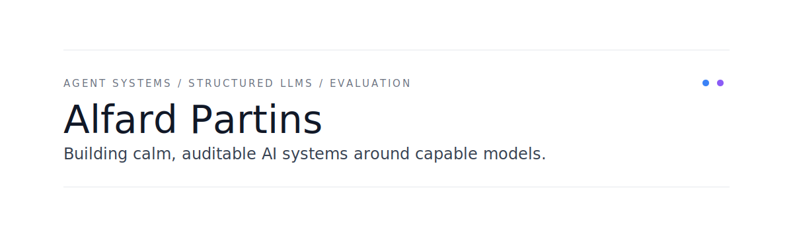

 

<table width="100%" bgcolor="#F4EDE3">
  <tr>
    <td>
      <h3>Craft</h3>
      
I work on the parts of AI systems that decide whether a demo can become a usable tool: context, memory, workflow state, tool boundaries, traces, evaluation, and structured outputs.

      <pre><code>agent harnesses      context -> tools -> approvals -> traces -> memory
structured outputs   data -> LoRA -> schema checks -> gold-set evaluation
model foundations    Transformer -> BPE -> SFT -> KV cache -> inference</code></pre>
    </td>
  </tr>
</table>

 

<table width="100%" bgcolor="#F4EDE3">
  <tr>
    <td colspan="2">
      <h3>Selected Work</h3>
    </td>
  </tr>
  <tr>
    <td width="50%" valign="top">
      <h3><a href="https://github.com/Alfard-Partins/Rune-agent">Rune</a></h3>
      
<em>A local coding-agent harness for real repositories.</em>

      
Rune gives models controlled access to search, shell, patches, workspace memory, run traces, workflow phases, and approval boundaries.

      
<strong>Signal:</strong> deterministic workspace-memory eval reaches 100% index creation, architecture recall, symbol recall, stale rejection, and overall recall on its fixture.

    </td>
    <td width="50%" valign="top">
      <h3><a href="https://github.com/Alfard-Partins/StructLM">StructLM</a></h3>
      
<em>From a hand-written Transformer stack to finance complaint structuring.</em>

      
StructLM connects BPE, decoder-only Transformer blocks, LoRA, KV cache, CFPB data preparation, Qwen2.5 LoRA SFT, automatic evaluation, gold-set checks, and a web demo.

      
<strong>Signal:</strong> LoRA v1 reaches 100% JSON parse, schema validity, enum validity, and error-free rate on the project test split.

    </td>
  </tr>
</table>

 

<table width="100%" bgcolor="#F4EDE3">
  <tr>
    <td width="50%" valign="top">
      <h3>Principles</h3>
      
Build the harness, not just the prompt.

      
Keep traces and reports close to the work.

      
Treat evaluation as a design material.

      
Prefer systems that can be resumed, inspected, and improved.

    </td>
    <td width="50%" valign="top">
      <h3>Stack</h3>
      
<code>Python</code> · <code>PyTorch</code> · <code>Transformers</code> · <code>LoRA</code> · <code>Streamlit</code> · <code>Gradio</code>

      
<code>CLI tools</code> · <code>agent runtime design</code> · <code>structured evaluation</code>

    </td>
  </tr>
</table>

 

